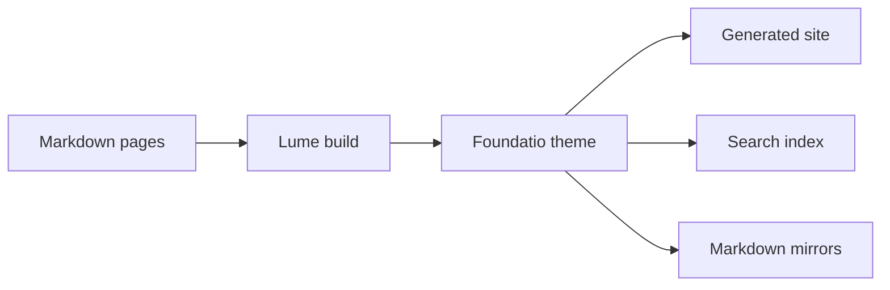

# Theme Demo

This page intentionally exercises common content patterns so theme changes can be checked in one place. It is not product copy; it is a compact visual fixture for markdown rendering, generated navigation, code highlighting, callouts, tables, badges, and Mermaid diagrams.

[[toc]]

## Typography

Foundatio Theme should make normal documentation feel calm and readable. Paragraphs, `inline code`, links, lists, blockquotes, and badges should all sit on the same typographic baseline without surprising spacing.

<Badge type="tip" text="Inline badge" /> <Badge type="warning" text="Warning" /> <Badge type="danger" text="Danger" />

- Navigation is generated from markdown front matter.
- Search, LLM files, and markdown mirrors are generated during the Lume build.
- Code blocks use the same Shiki rendering path in pages and detailed search excerpts.

> A blockquote should read as secondary documentation context, not as a card or callout.

## Callouts

::: info
Info callouts are useful for neutral context and short implementation notes.
:::

::: tip Success path
Tip callouts highlight the recommended path. Inline code such as `site.use(foundatio())` should inherit the correct callout code background.
:::

::: warning Watch the bundle
Warnings should stand out without turning the whole page into an alert. They often mention tradeoffs, version constraints, or migration details.
:::

::: danger Deployment check
Danger callouts are reserved for things that can break deployed sites, such as serving extensionless HTML files as downloads.
:::

::: details Rendered details open
Details blocks should render as expandable content and preserve nested markdown.

```ts
export const expanded = true;
```
:::

## Code Blocks

Code blocks should use VitePress-style chrome, copy buttons, language labels, optional line numbers, highlighted lines, focused lines, warnings, errors, and colored diffs.

```js
export default {
  name: "FoundatioTheme"
}
```

```ts {5-8}
import lume from "lume/mod.ts";
import foundatio from "jsr:@foundatiofx/lume-theme";

// Keep theme setup in Lume config.
const site = lume({ prettyUrls: true });
site.use(foundatio({
  title: "My Project",
  description: "Project documentation",
  docsRoot: "guide",
}));

export default site;
```

```csharp:line-numbers=10
public record BuildSite(string Name);

public sealed class BuildSiteHandler
{
    public string Handle(BuildSite command)
    {
        return $"Built {command.Name}";
    }
}
```

```js
export default {
  data() {
    return {
      msg: "Focused!" // [!code focus]
    }
  }
}
```

```js
export default {
  data() {
    return {
      msg: "Removed" // [!code --]
      msg: "Added" // [!code ++]
      warning: "Check this" // [!code warning]
      error: "Fix this" // [!code error]
    }
  }
}
```

## Code Groups
::: code-group

```ts:line-numbers [theme.ts]
import lume from "lume/mod.ts";
import foundatio from "jsr:@foundatiofx/lume-theme";

// Keep theme setup in Lume config.
const site = lume({ prettyUrls: true });

site.use(foundatio({
  title: "Project Docs",
  description: "Technical documentation",
  docsRoot: "guide",
}));

export default site;
```

```md:line-numbers [guide/page.md]
---
title: Page Title
nav:
  section: Guide
  order: 1
---

# Page Title

Write normal markdown content.
```

```csharp:line-numbers=10 [src/BuildSiteHandler.cs]
public record BuildSite(string Name);

public sealed class BuildSiteHandler
{
    public string Handle(BuildSite command)
    {
        return $"Built {command.Name}";
    }
}
```

:::

A code group with one file should still keep the same tab and block chrome.

::: code-group

```ts:line-numbers [single.config.ts]
import lume from "lume/mod.ts";
import foundatio from "jsr:@foundatiofx/lume-theme";

const site = lume({ prettyUrls: true });
site.use(foundatio({ title: "Single File Group" }));

export default site;
```

:::
## Tables

| Feature          | Output                             | Notes                         |
| ---------------- | ---------------------------------- | ----------------------------- |
| Local search     | `search-index.json`                | Compact section-level records |
| LLM index        | `llms.txt` and `llms-full.txt`     | Generated from docs content   |
| Markdown mirrors | `.md` files beside clean docs URLs | Authoring metadata stripped   |

## Mermaid

Mermaid diagrams should be lazy-loaded and rendered after the page is interactive.



## Links

Internal links such as [Getting Started](/guide/getting-started) and [Components](/guide/components) should use clean URLs and pass URL checking. External links such as [Lume](https://lume.land/) should retain their normal external-link treatment.

## Footer Navigation

This page is part of the generated sidebar, so it should receive previous and next page links from surrounding guide pages.
